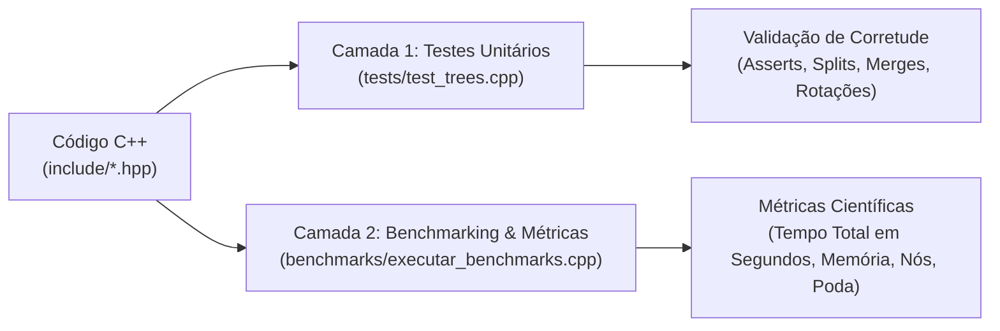

# Modelagem, Implementação e Análise Comparativa de Estruturas em Árvores Especializadas

Trabalho Prático Individual I — **Algoritmos e Estruturas de Dados II (AEDS II)**  

---

## 📌 Visão Geral do Projeto

Este repositório contém o estudo formal, a implementação computacional de alto desempenho (C++17) e a avaliação experimental de **cinco estruturas de dados hierárquicas avançadas**, além de duas estruturas de referência (*baselines*):

1. **Árvore Trie** (*Prefix Tree* / Árvore de Prefixos)
2. **Árvore Patricia** (*Practical Algorithm To Retrieve Information Coded In Alphanumeric* / Radix Tree Compacta)
3. **Árvore Splay** (*Self-Adjusting Binary Search Tree* / Árvore de Busca Binária Autoajustável)
4. **Árvore Treap** (*Tree + Heap* / Árvore de Busca Binária com Balanceamento Probabilístico)
5. **KD-Tree** (*k-Dimensional Tree* / Árvore de Particionamento Espacial Multidimensional)
6. **Baselines de Comparação:** **BST Convencional** e **Árvore AVL**

---

## 📁 Arquitetura do Repositório

```text
Estruturas-em-Arvores/
├── include/                     # Headers modulares C++17 das estruturas
│   ├── trie.hpp                 # Trie com busca por prefixo, autocomplete e exportação JSON
│   ├── patricia.hpp             # Patricia Tree com compactação de arestas (split/merge)
│   ├── splay_tree.hpp           # Splay Tree com passos Zig, Zig-Zig e Zig-Zag
│   ├── treap.hpp                # Treap com rotações e prioridades de Max-Heap
│   ├── kd_tree.hpp              # KD-Tree multidimensional com 1-NN e Range Search
│   ├── bst.hpp                  # Baseline: Árvore Binária de Busca Padrão
│   └── avl_tree.hpp             # Baseline: Árvore AVL Estritamente Balanceada
├── tests/                       # Camada 1: Testes Unitários e Validação de Casos de Borda
│   └── test_trees.cpp           # Suite com 100% de cobertura e asserções formais
├── benchmarks/                  # Camada 2: Metodologia Experimental e Benchmarking
│   ├── datasets/                # Matriz completa de 51 datasets (N = 100 a 100.000)
│   │   ├── 1_strings/           # Prefixos densos, dispersos e pior caso linear
│   │   ├── 2_numericos/         # Ordenados cresc/decresc, aleatórios, quase-ordenados e Zipf
│   │   ├── 3_espaciais/         # Distribuições uniformes 2D/3D, clusters e alvos de busca
│   │   └── gerar_datasets.py    # Script reprodutível de geração dos datasets
│   ├── executar_benchmarks.cpp  # Painel Interativo em C++ com cronometragem em segundos (s)
│   └── dados_comparativos.csv   # Resultados experimentais brutos consolidados
├── relatorio/                   # Artigo Técnico Acadêmico (8 a 12 páginas em LaTeX)
│   ├── secoes/
│   └── figuras/
├── Makefile                     # Build system automatizado
└── CMakeLists.txt               # Configuração CMake multiplataforma
```

---

## 🧪 Metodologia de Avaliação e Baterias de Testes

O projeto adota uma abordagem de testes em **duas camadas independentes**:



---

### 🔬 Camada 1: Testes Unitários e Casos de Borda (`tests/test_trees.cpp`)
Focada em garantir que todas as invariantes estruturais e operações fundamentais funcionem sem falhas:

* **Trie e Patricia:** Validação de inserção exata, sobreposição parcial de prefixos, busca de chaves ausentes, `startsWith`, `autocomplete`, remoção com poda de ramos órfãos na Trie e **fusão de nós (*merge*)** na Patricia.
* **Splay Tree:** Verificação do autoajuste trazendo o elemento acessado para a raiz através de combinações de rotações **Zig**, **Zig-Zig** e **Zig-Zag**, bem como remoção via *split & join*.
* **Treap:** Validação da invariante de **BST sobre as chaves** e **Max-Heap sobre as prioridades**, com rotações determinísticas na subida e rotações descendentes na remoção.
* **KD-Tree:** Verificação dos cortes alternados por dimensão ($X \to Y \to X$), consultas de **Vizinho Mais Próximo (*1-NN*)** e consultas por intervalo (**Range Search** em caixas delimitadoras).
* **Baselines (BST e AVL):** Teste de degeneração linear na BST e verificação do fator de balanceamento $FB \in \{-1, 0, 1\}$ com altura $\le 1.44 \log_2(N)$ na AVL.

---

### 📈 Camada 2: Benchmarks de Desempenho e Métricas Científicas (`benchmarks/executar_benchmarks.cpp`)
Executa o **ciclo completo de vida** de cada estrutura com tamanhos de entrada $N \in \{100, 1.000, 10.000, 50.000, 100.000\}$:

```text
[1. Inserção em Massa] ──▶ [2. Busca (Sucesso)] ──▶ [3. Busca (Falha)] ──▶ [4. Operação Específica] ──▶ [5. Remoção 50%]
```

#### 🗂️ Matriz de Datasets Disponíveis para Seleção no Benchmark:

1. **Datasets de Strings (Trie e Patricia Tree):**
   * `Prefixos Densos (Dicionário Real)`: Alta sobreposição de prefixos comuns (`computador`, `computacao`, `compilador`), evidenciando a compressão de nós da Patricia.
   * `Prefixos Dispersos (Aleatórias)`: Strings uniformes sem prefixos comuns.
   * `Pior Caso Linear`: String de 120 caracteres sem ramificações (Trie cria 122 nós; Patricia compacta em 4 nós).

2. **Datasets Numéricos (Splay, Treap, AVL e BST):**
   * `Aleatório Uniforme`: Permutação uniforme $1 \dots N$ (caso médio assintótico).
   * `Ordenado Crescente (1 .. N)`: Pior caso clássico da BST ($\mathcal{O}(N^2)$ acumulado), testando as rotações de heap da Treap e rotações AVL.
   * `Ordenado Decrescente (N .. 1)`: Pior caso espelhado.
   * `Quase Ordenado`: $95\%$ ordenado com $5\%$ de perturbações aleatórias.
   * `Localidade Temporal (Zipf 80-20 e 90-10)`: $100.000$ consultas concentradas em $20\%$ ou $10\%$ das chaves mais frequentes.

3. **Datasets Espaciais Multidimensionais (KD-Tree):**
   * `Uniformes 2D / 3D`: Coordenadas distribuídas homogeneamente no espaço $[-1000, 1000]^K$.
   * `Clusters Gaussianos 2D`: Agrupamentos densos em ilhas espaciais (simulando cidades e pontos de interesse em sistemas GIS).

---

## 🛠️ Como Compilar e Executar com o Makefile

O projeto dispõe de um `Makefile` automatizado com suporte completo a compilação com flags rigorosas (`-std=c++17 -Wall -Wextra -Wpedantic -O3`):

### 1. Compilar todo o projeto
```bash
make all
```

### 2. Executar a Suíte de Testes Unitários
Valida a integridade lógica, casos de borda e asserções de todas as estruturas:
```bash
make test
```

### 3. Gerar a Matriz Completa de Datasets
Executa o script Python que gera os 51 arquivos de teste em `benchmarks/datasets/`:
```bash
make datasets
```

### 4. Executar o Painel Interativo de Benchmarks
Abre o menu interativo no terminal, permitindo escolher qual árvore executar, o tipo de dataset (Ordenado, Decrescente, Aleatório, Quase-Ordenado, etc.), o tamanho $N$ e modos comparativos:
```bash
make bench
```

### 5. Executar Bateria Completa de Benchmarks (Modo Automático)
Executa todos os 51 experimentos em lote e grava os resultados em `benchmarks/dados_comparativos.csv`:
```bash
make bench-all
```

### 6. Limpar binários e arquivos temporários
```bash
make clean
```
